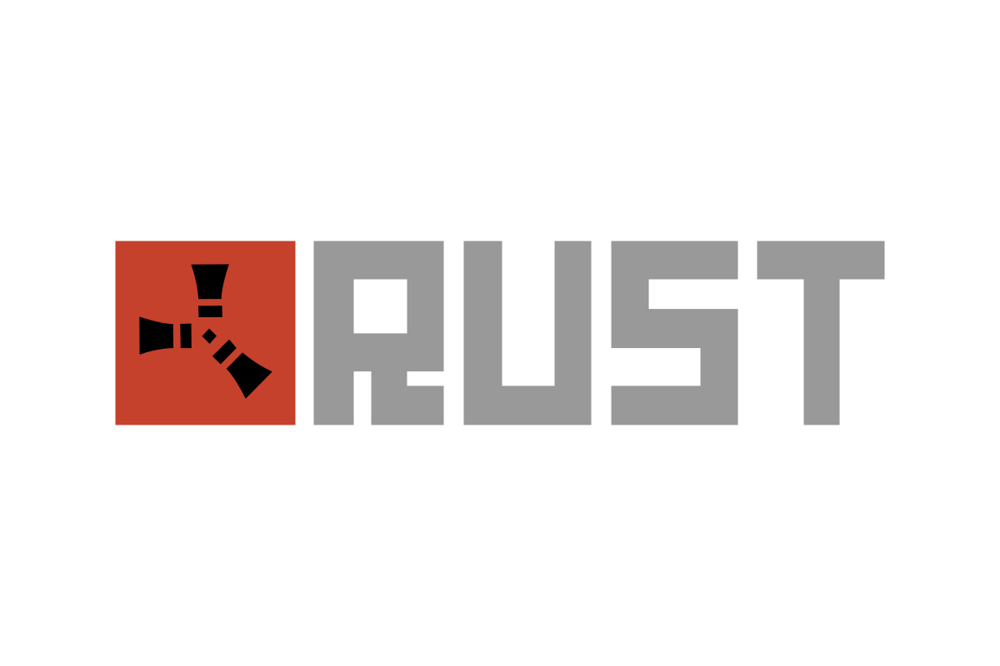
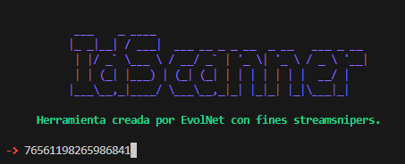
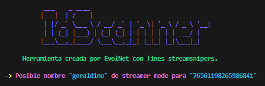

# Rust Stalker

Herramienta basica en desarrollo para rastrear jugadores de Rust. Te permite visualizar el historial de nombres, te permite ver el nombre de streamer mode y tambien en que server esta jugando mediante filtros usando BattleMetrics.

